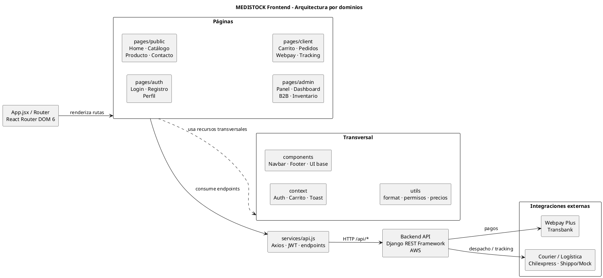

# Documentacion frontend Medistock

Ultima actualizacion: 2026-05-27

## Vision general

El frontend de Medistock es una aplicacion React + Vite para venta y gestion de insumos medicos. Consume una API Django REST Framework mediante un cliente HTTP centralizado en `src/services/api.js`.

La aplicacion cubre tres areas principales:

- Experiencia publica: home ecommerce, catalogo, detalle de producto y contacto.
- Flujo cliente: autenticacion, carrito, confirmacion de pedido, Webpay, pedidos y tracking.
- Panel interno: dashboard, aprobaciones B2B, inventario, productos, trabajadores, pagos, traslados e integraciones demo/controladas.

## Stack real

Segun `package.json`, el frontend usa:

- React 18.
- Vite 5.
- React Router DOM 6.
- Axios.
- Downshift para combobox/selectores con busqueda.
- Recharts para graficos del dashboard analista.

Scripts disponibles:

- `npm run dev`: servidor local Vite.
- `npm run build`: build de produccion.
- `npm run preview`: previsualizacion del build.

## Estructura de carpetas

Estructura relevante despues del ordenamiento:

```text
src/
  App.jsx
  main.jsx
  index.css
  components/
    Footer.jsx
    Navbar.jsx
    ToastViewport.jsx
    ui/
      Badge.jsx
      Button.jsx
      Card.jsx
      DataTable.jsx
      EmptyState.jsx
      Spinner.jsx
      index.js
  context/
    AuthContext.jsx
    CarritoContext.jsx
    ToastContext.jsx
  pages/
    public/
      HomePage.jsx
      CatalogoPage.jsx
      ProductoDetallePage.jsx
      ContactoPage.jsx
    auth/
      LoginPage.jsx
      RegistroPage.jsx
      PerfilPage.jsx
    client/
      CarritoPage.jsx
      ConfirmacionPedidoPage.jsx
      ResultadoPagoPage.jsx
      WebpayResultadoPage.jsx
      TrackingPage.jsx
      PedidoDetallePage.jsx
      ComprobanteDtePage.jsx
    admin/
      PanelPage.jsx
      DashboardAnalistaPage.jsx
      AprobacionesB2BPage.jsx
      AdminProductosPage.jsx
      AdminTrabajadoresPage.jsx
      ComprasProveedorPage.jsx
      ConciliacionPagosPage.jsx
      ConveniosInstitucionalesPage.jsx
      GuiasDespachoPage.jsx
      IntegracionesPage.jsx
      TrasladosInventarioPage.jsx
  services/
    api.js
  utils/
    catalogoEnriquecido.js
    cotizacionStorage.js
    format.js
    gruposCatalogo.js
    permisos.js
```

## Diagrama PlantUML de estructura

El diagrama fuente esta en `docs/frontend-structure.puml`.

Para renderizarlo se puede usar una extension PlantUML del editor, PlantUML Server o una herramienta local compatible con `.puml`.



## Responsabilidades por carpeta

- `components/`: componentes reutilizables globales como Navbar, Footer, toasts y componentes UI base.
- `context/`: estado global de autenticacion, carrito y notificaciones.
- `pages/public/`: paginas visibles sin iniciar sesion o de consulta publica.
- `pages/auth/`: login, registro y perfil de usuario.
- `pages/client/`: flujo de compra, pagos, pedidos y tracking.
- `pages/admin/`: panel interno, administracion de productos/trabajadores y modulos operativos.
- `services/api.js`: cliente Axios, interceptores JWT, normalizacion de respuestas y funciones hacia endpoints backend.
- `utils/`: helpers de formato, permisos, precios, catalogo y persistencia auxiliar de cotizacion.

## Rutas frontend principales

Rutas publicas:

- `/`: Home ecommerce.
- `/contacto`: pagina de contacto.
- `/catalogo`: catalogo conectado a backend.
- `/producto/:codigo`: detalle de producto.
- `/login`: login.
- `/registro`: registro cliente.
- `/resultado-pago`: resultado Webpay.
- `/webpay/resultado`: retorno Webpay accesible sin login.

Rutas protegidas:

- `/perfil`: perfil de usuario autenticado.
- `/panel`: panel principal.
- `/tracking/:despachoId`: tracking.
- `/pedidos/:id`: detalle de pedido.
- `/dte/:id/comprobante`: comprobante DTE.

Rutas solo compradores:

- `/carrito`
- `/confirmar-pedido`
- `/resultado-pago/:pedidoId`

Rutas internas/admin:

- `/admin/productos`
- `/admin/trabajadores`
- `/panel/dashboard-analista`
- `/panel/aprobaciones-b2b`
- `/panel/traslados-inventario`
- `/panel/compras-proveedor`
- `/panel/conciliacion-pagos`
- `/panel/convenios-institucionales`
- `/panel/guias-despacho`
- `/panel/integraciones`

## Endpoints consumidos

Autenticacion y cuenta:

- `POST /api/accounts/login/`
- `POST /api/accounts/logout/`
- `POST /api/accounts/login/refresh/`
- `GET/PATCH /api/accounts/perfil/me/`
- `POST /api/accounts/registro/cliente/`
- `POST /api/accounts/registro/trabajador/`
- `GET/PATCH /api/accounts/trabajadores/`
- `GET/POST /api/accounts/mis-direcciones/`

Catalogo e inventario:

- `GET /api/inventory/catalogo/`
- `GET /api/inventory/public/productos/<id>/`
- `GET /api/inventory/public/categorias/`
- `GET /api/inventory/productos/`
- `POST /api/inventory/productos/`
- `POST /api/inventory/ingresar-producto/`
- `GET /api/inventory/categorias/`
- `GET /api/inventory/marcas/`
- `GET /api/inventory/inventarios/`
- `GET /api/inventory/lotes/`
- `GET /api/inventory/movimientos/`
- `GET /api/inventory/traslados/`

Pedidos:

- `POST /api/orders/pedidos/`
- `GET /api/orders/pedidos/mis-pedidos/`
- `GET /api/orders/pedidos/todos/`
- `GET /api/orders/pedidos/<id>/`
- `POST /api/orders/pedidos/<id>/aprobar/`

Pagos:

- `POST /api/payments/webpay/iniciar/`
- `GET /api/payments/webpay/commit/`
- `GET /api/payments/webpay/estado/<token_ws>/`
- `GET /api/payments/mis-pagos/`

Logistica y ubicaciones:

- `POST /api/logistics/cotizar/`
- `GET /api/logistics/envios/<pedido_id>/tracking/`
- `POST /api/logistics/courier/generar/`
- `GET /api/logistics/courier/tracking/<numero>/`
- `GET /api/locations/regions/`
- `GET /api/locations/comunas/`
- `GET /api/locations/sucursales/<id>/`

## Vistas por tipo de usuario

Visitante:

- Puede ver home, contacto, catalogo y detalle de producto.
- Puede ir a login o registro.

Cliente B2C/B2B:

- Puede comprar desde catalogo.
- Puede usar carrito, confirmacion, cotizacion de despacho, Webpay, pedidos y tracking.
- El precio visible usa `precio_con_iva` si viene desde backend.

Trabajador/admin:

- Puede entrar al panel interno segun rol y permisos.
- Puede revisar dashboard, aprobaciones B2B, inventario, pagos, integraciones y modulos administrativos disponibles.
- No puede completar checkout como cliente; el frontend bloquea el flujo antes de llegar al 403 del backend.

## Autenticacion y sesion

El login usa `POST /api/accounts/login/`. Al iniciar sesion correctamente, el frontend guarda:

- Access token.
- Refresh token.
- Datos minimos de usuario.

La sesion se conserva en `localStorage`, por lo que un F5 no deberia expulsar al usuario si los tokens siguen siendo validos.

El interceptor de Axios adjunta `Authorization: Bearer <access_token>` en cada request autenticada. Si una respuesta devuelve 401, intenta refresh con `/api/accounts/login/refresh/` cuando existe refresh token. Si el refresh falla, limpia la sesion.

Caso especial: `GET /api/accounts/perfil/me/` puede responder 404 cuando el usuario no tiene perfil cliente/trabajador asociado. Ese 404 no borra automaticamente la sesion si ya existen datos minimos del login.

## Carrito y checkout

El carrito vive en `CarritoContext.jsx`.

Reglas relevantes:

- Solo usuarios cliente pueden avanzar en el flujo de compra.
- Admin/trabajador pueden ser redirigidos o bloqueados con mensaje claro.
- La confirmacion de pedido calcula payload compatible con backend.
- La direccion alternativa solo se intenta crear para usuarios cliente.
- La cotizacion de despacho usa `/api/logistics/cotizar/`.
- La creacion de pedido usa `/api/orders/pedidos/`.
- Webpay inicia con `/api/payments/webpay/iniciar/`.

## Precios e IVA

El frontend usa `precio_con_iva` como precio principal cuando el backend lo entrega.

Fallback de precios:

1. `precio_con_iva`
2. `precio_b2c`
3. `precio_b2b`
4. `valor_unitario`
5. `precio`

El frontend no recalcula IVA con `1.19` para evitar duplicar el impuesto cuando el backend ya lo envia calculado.

## Inventario y administracion

Gestion de productos:

- Pantalla: `pages/admin/AdminProductosPage.jsx`.
- Producto simple: `POST /api/inventory/productos/`.
- Producto con stock inicial: `POST /api/inventory/ingresar-producto/`.
- El ingreso con stock permite crear o recuperar producto por SKU, asociar categorias, crear/recuperar lote, actualizar inventario y registrar movimiento de entrada.

Gestion de trabajadores:

- Pantalla: `pages/admin/AdminTrabajadoresPage.jsx`.
- Registro: `POST /api/accounts/registro/trabajador/`.
- Listado/actualizacion: `/api/accounts/trabajadores/`.
- El formulario muestra email como dato visible de acceso y envia internamente `username = email` para compatibilidad con el serializer backend.

Dashboard analista:

- Usa pedidos, inventario, lotes, movimientos y pagos si el usuario tiene permisos.
- El grafico de ventas por mes usa Recharts y datos reales desde pedidos.

## Manejo de errores

Patrones actuales:

- 403: mensaje de permisos insuficientes.
- 404: mensaje de informacion no encontrada o perfil incompleto.
- 409: se muestra el mensaje real del backend cuando viene en campos como `detail`, `error`, `message`, `stock` o estructuras anidadas.
- 500: mensaje de error del servidor.
- Error de red/backend apagado: mensaje de imposibilidad de conexion.

En aprobaciones B2B, los errores de stock/reserva insuficiente se muestran en una alerta roja dentro de pantalla.

## Responsividad y UI

La interfaz usa CSS por pagina y componentes UI simples.

Puntos visuales recientes:

- Home con carrusel hero, productos destacados, categorias visuales, promociones y footer.
- Cards de productos destacados y promociones alineadas con flex column, imagen fija y footer anclado.
- Footer reutilizable en Home y Catalogo.
- Dashboard con tarjetas de metricas y grafico responsive.
- Paneles administrativos con cards, tablas, alertas y formularios responsive.

## Pendientes tecnicos

- Separar `services/api.js` en modulos por dominio cuando crezca mas: `authApi`, `inventoryApi`, `ordersApi`, `paymentsApi`, `logisticsApi`.
- Revisar permisos backend del registro de trabajadores si sigue abierto con `AllowAny`.
- Completar integraciones reales para pantallas que siguen como demo controlada.
- Evaluar code splitting porque Vite advierte que el bundle principal supera 500 kB.
- Revisar fallback SPA en hosting para refrescar rutas internas.
- Probar de punta a punta el flujo cliente en ambiente limpio.
- Probar que los roles reales del backend coincidan con rutas protegidas del frontend.

## Changelog real

Cambios recientes relevantes:

- Reordenamiento de paginas por dominio: `public`, `auth`, `client`, `admin`.
- Persistencia de sesion tras F5.
- Tolerancia al 404 de `/api/accounts/perfil/me/`.
- Uso de `precio_con_iva` como precio principal.
- Bloqueo de checkout para usuarios no cliente.
- Panel administrativo de productos.
- Ingreso de producto con stock inicial usando `/api/inventory/ingresar-producto/`.
- Panel administrativo de trabajadores.
- Uso interno de `username = email` en creacion de trabajadores.
- Aprobaciones B2B conectadas a pedidos reales y errores 409 visibles.
- Dashboard analista con metricas reales y grafico Recharts.
- Home ecommerce con carrusel, categorias, promociones y cards alineadas.

## Pruebas recomendadas

Antes de entregar cambios frontend:

- `npm run build`
- `git diff --check`
- Login y refresh manual con F5.
- Catalogo y detalle de producto.
- Carrito y bloqueo para admin/trabajador.
- Confirmacion de pedido con cuenta cliente.
- Inicio y retorno Webpay.
- Panel admin: productos, trabajadores, dashboard y aprobaciones B2B.
